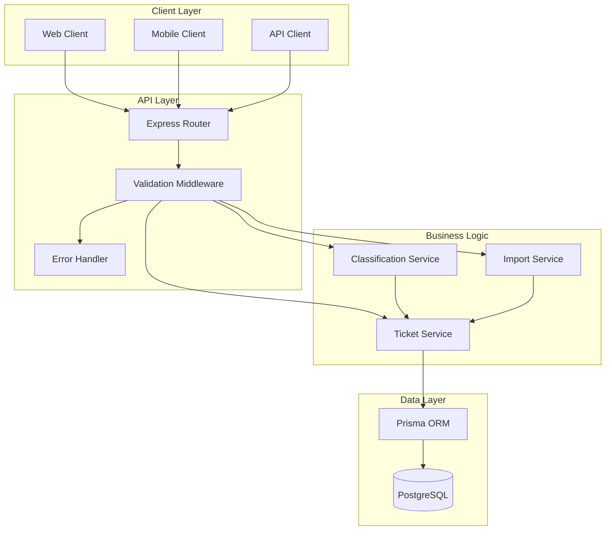
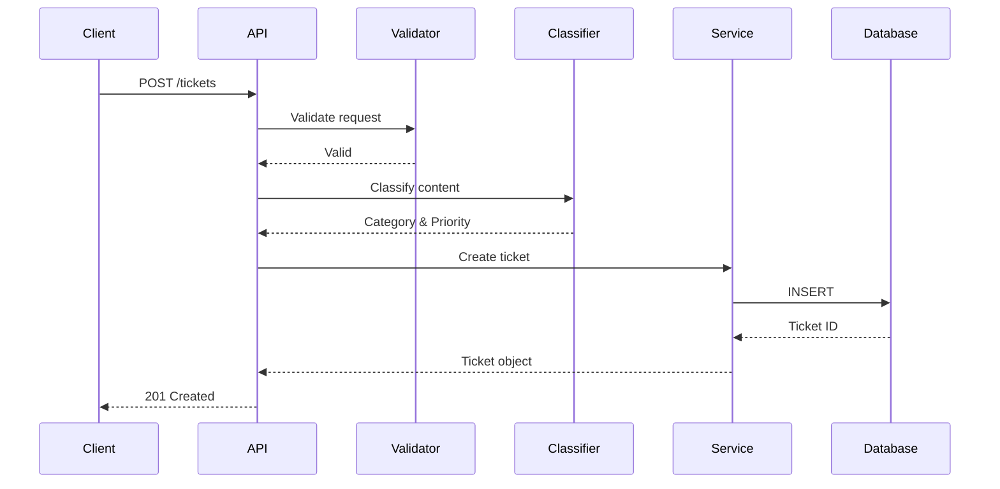
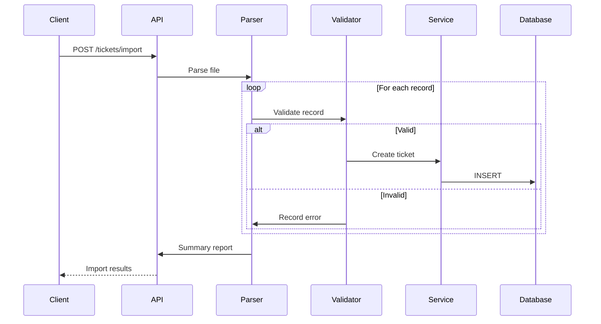
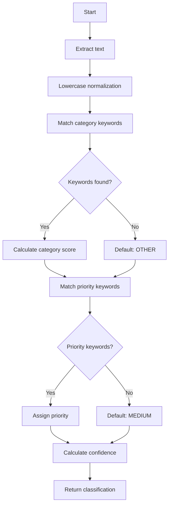
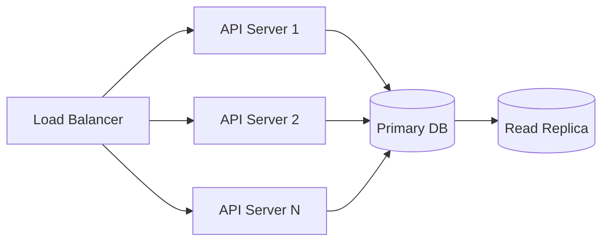

# Architecture Documentation

## System Overview

Customer Support Ticket Management System built with Node.js, Express, TypeScript, and PostgreSQL.

## High-Level Architecture

## Component Descriptions

### API Layer

**Express Router** (`routes/tickets.routes.ts`)
- Endpoint definitions
- Request routing
- Multer file upload handling
- Response formatting

**Validation Middleware** (`utils/validation.ts`)
- Zod schema validation
- Input sanitization
- Error generation

**Error Handler**
- Centralized error responses
- HTTP status code mapping
- Error logging

### Business Logic Layer

**Ticket Service** (`services/ticket.service.ts`)
- CRUD operations
- Business rule enforcement
- Transaction management
- Filtering logic

**Classification Service** (`services/classification.service.ts`)
- Keyword pattern matching
- Category detection
- Priority determination
- Confidence scoring

**Import Service** (`services/import.service.ts`)
- CSV parsing (csv-parser)
- JSON parsing (native)
- XML parsing (xml2js)
- Validation integration
- Error aggregation

### Data Layer

**Prisma ORM**
- Type-safe database access
- Migration management
- Query optimization
- Connection pooling

**PostgreSQL Database**
- Relational data storage
- ACID compliance
- Indexing
- Enum type support

## Data Flow Diagrams

### Ticket Creation Flow

### Import Flow

### Classification Algorithm

## Design Decisions

### Architecture Pattern: Layered Architecture

**Rationale:**
- Clear separation of concerns
- Testability
- Maintainability
- Independent layer evolution

**Trade-offs:**
- Slight performance overhead
- More boilerplate code
- Complexity for simple operations

### Technology Choices

**TypeScript over JavaScript**
- Type safety reduces runtime errors
- Better IDE support
- Self-documenting code
- Easier refactoring

**Prisma over Raw SQL**
- Type-safe queries
- Automatic migrations
- Cross-database compatibility
- Reduced boilerplate

**Zod over Joi**
- TypeScript-first design
- Type inference
- Composability
- Smaller bundle size

**Jest over Mocha**
- All-in-one solution
- Built-in coverage
- Snapshot testing
- Better TypeScript support

### Classification Strategy: Rule-Based vs ML

**Chosen: Rule-Based (Keyword Matching)**

**Rationale:**
- No training data required
- Predictable behavior
- Fast inference
- Easy to debug
- Transparent decisions

**Trade-offs:**
- Limited accuracy
- Maintenance overhead
- No learning capability

**Future Enhancement:**
Integrate ML model (NLP) when training data available.

### Database Schema Design

**Enums in PostgreSQL**
- Data integrity
- Query optimization
- Storage efficiency
- Clear constraints

**Denormalized Classification Fields**
- Query performance
- Audit trail
- Historical accuracy

## Security Considerations

### Input Validation
- All inputs validated with Zod
- String length limits enforced
- Email format verification
- Enum constraint checking

### SQL Injection Prevention
- Prisma ORM parameterized queries
- No raw SQL concatenation
- Type-safe query builder

### File Upload Security
- File size limits
- MIME type validation
- Memory-based storage (no disk writes)
- Extension whitelist

### Error Handling
- No stack trace exposure
- Generic error messages
- Detailed logging server-side
- Input sanitization

## Performance Considerations

### Database Optimization
- Primary key indexing (UUID)
- Enum fields for fast filtering
- Connection pooling via Prisma
- Prepared statement caching

### API Performance
- Streaming for file parsing
- Async/await for I/O operations
- Stateless design (horizontal scaling)
- No in-memory session storage

### Import Optimization
- Streaming CSV parser
- Batch validation
- Early error detection
- Parallel processing potential

### Caching Strategy
Not implemented (stateless design).

**Future Enhancement:**
- Redis for classification cache
- Query result caching
- Session management

## Scalability

### Horizontal Scaling
- Stateless API servers
- Database connection pooling
- Load balancer ready
- No shared state

### Vertical Scaling
- Database indexing
- Query optimization
- Efficient data structures

### Bottlenecks
- Database write throughput
- File parsing for large imports
- Classification for high volume

**Mitigation:**
- Database read replicas
- Background job processing (Queue)
- Caching layer

## Deployment Architecture

## Monitoring & Logging

**Logging:**
- Error logging via console
- Request/response logging
- Classification decisions logged

**Metrics:**
- API response times
- Database query performance
- Import success rates
- Classification accuracy

**Future Enhancement:**
- Application Performance Monitoring (APM)
- Distributed tracing
- Metrics dashboard
- Alert system

## API Versioning

**Current:** No versioning (v1 implicit)

**Future Strategy:**
- URL versioning (`/v2/tickets`)
- Header-based versioning
- Deprecation notices
- Backward compatibility

## Error Recovery

**Database Connection Loss:**
- Prisma auto-reconnect
- Graceful degradation
- Error responses to clients

**Import Failures:**
- Per-record error tracking
- Partial success reporting
- No transaction rollback (progressive insertion)

## Testing Strategy

**Unit Tests:**
- Service layer logic
- Validation schemas
- Classification algorithm
- Import parsers

**Integration Tests:**
- End-to-end workflows
- Database operations
- API contracts

**Performance Tests:**
- Concurrent requests
- Large file imports
- Query performance

## Future Enhancements

1. **Machine Learning Classification**
   - NLP-based categorization
   - Priority prediction
   - Sentiment analysis

2. **Real-time Features**
   - WebSocket support
   - Live updates
   - Notifications

3. **Advanced Search**
   - Full-text search (PostgreSQL FTS)
   - Elasticsearch integration
   - Faceted search

4. **Analytics**
   - Ticket trends
   - Response time metrics
   - Agent performance

5. **Multi-tenancy**
   - Organization isolation
   - Role-based access control
   - Custom fields per tenant
