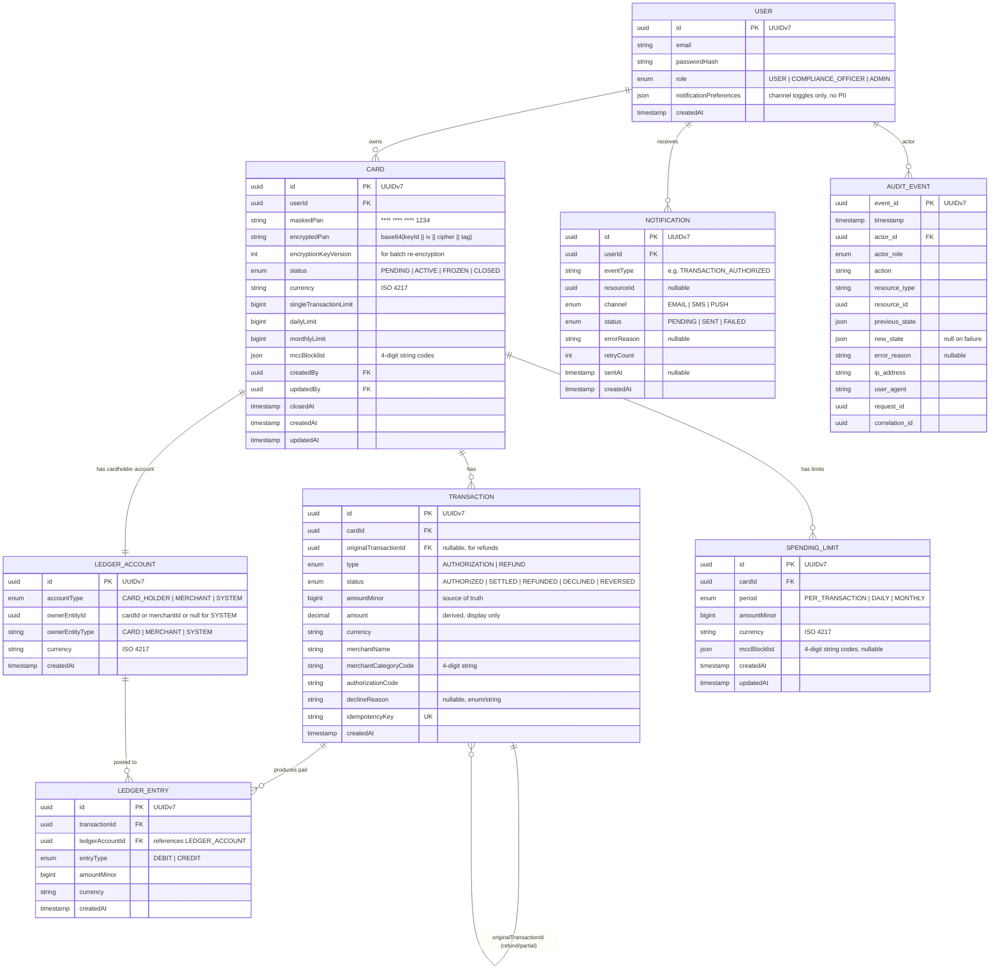

# Virtual Card Management System — Specification

> Ingest the information from this file, implement the Low-Level Tasks, and generate the code that will satisfy the High and Mid-Level Objectives.

## High-Level Objective

- Build a secure, auditable Virtual Card Management System that enables end-users to create, manage, and monitor virtual payment cards while providing an internal operations/compliance dashboard for oversight, fraud detection, and regulatory reporting — all within a PCI DSS-compliant architecture.

## Mid-Level Objectives

1. **Card Lifecycle Management** — Allow authenticated users to create virtual cards, activate/freeze/unfreeze them, set per-card spending limits, and close cards with full state-transition auditing.
2. **Transaction Ledger & Double-Entry Bookkeeping** — Record every card transaction (authorizations, settlements, refunds, declines) in a double-entry ledger following a two-phase model. **"Append-only" applies to `LedgerEntry` records** (once created, they are never updated or deleted); `Transaction` rows allow status updates (e.g., `AUTHORIZED` → `SETTLED`) but not deletion:
   - **AUTHORIZATION** creates the `Transaction` record (status `AUTHORIZED`) and a balanced pair of `LedgerEntry` records (DEBIT cardholder, CREDIT merchant). This is the only phase that creates ledger entries and affects spending-limit aggregations.
   - **SETTLEMENT** updates the existing Transaction record's status from `AUTHORIZED` → `SETTLED` in-place (no new Transaction row is created). **No new ledger entries are created** — the original entries remain as the financial record. This prevents double-counting in limits and analytics. **Settlement amount must equal authorization amount** (`settlementAmountMinor == amountMinor` and same `currency`); partial settlement, tips, and incremental authorization are not supported — a mismatch returns an error (`unsupported_event`).
   - **REFUND** creates a new Transaction (type `REFUND`, linked via `originalTransactionId`) with **reverse ledger entries** (CREDIT cardholder, DEBIT merchant). Partial refunds are supported.
   - **DECLINE** creates a Transaction (`type: AUTHORIZATION`, `status: DECLINED`) with **no ledger entries**.
   Support `TransactionStatus` states: `AUTHORIZED`, `SETTLED`, `REFUNDED`, `DECLINED`, `REVERSED`.
3. **Spending Controls & Limits** — Enforce configurable spending caps (per-transaction, daily, monthly) and merchant-category restrictions, evaluating them in real time before authorizing a transaction.
4. **Compliance & Audit Trail** — Capture every state change and sensitive-data access in a tamper-evident audit log; support data-retention policies and regulatory exports (PCI DSS, PSD2, GDPR).
5. **Internal Ops Dashboard** — Provide compliance officers with tools to search cards/transactions, flag suspicious activity, freeze cards on behalf of users, and generate regulatory reports. Card closure on behalf of users is restricted to admins only (see Ops module for full role matrix).
6. **Notifications & Alerts** — Deliver real-time alerts to users on transaction outcomes, limit breaches, and card-status changes; deliver internal alerts for fraud-pattern triggers.
7. **Security & Data Protection** — Encrypt card PANs at rest (AES-256) and in transit (TLS 1.3), tokenize card numbers for display, enforce RBAC, and integrate with an HSM for key management.

## Out of Scope

- **Real card issuance** — No integration with a real card network (Visa/Mastercard). The payment processor is a mock that implements the same interface a real provider would expose.
- **Real payment processing** — No actual money movement. All authorizations, settlements, and refunds are simulated within the mock processor.
- **PCI DSS external certification** — The architecture follows PCI DSS v4.0 principles, but no formal QSA audit or SAQ is performed.
- **Production HSM** — In local development and CI, key management uses a software KMS stub that implements the HSM interface (`KmsService`); production HSM integration is an infrastructure concern outside this codebase.
- **UI / Frontend** — No client-side application; only REST API endpoints are delivered.
- **Multi-currency exchange** — Cards operate in a single currency set at creation time; FX conversion is not supported.
- **Notification delivery infrastructure** — Email, SMS, and push strategies use stub adapters; actual delivery provider integration is out of scope.

## Architecture Diagrams

### System Architecture


### Card State Machine


### Transaction Authorization Flow


### Entity Relationship Diagram



### Transaction Type/Status Matrix

`Transaction.type` represents the **kind of operation**; `Transaction.status` represents its **lifecycle state**. Settlement is **not** a separate type — it is a status transition on an existing `AUTHORIZATION` row (no new Transaction record is created).

Valid combinations (all other combinations are illegal):

| `type`          | Valid `status` values                         | Creates LedgerEntry? | Notes |
|-----------------|-----------------------------------------------|----------------------|-------|
| `AUTHORIZATION` | `AUTHORIZED` → `SETTLED` or `REVERSED` or `DECLINED` | Only if `AUTHORIZED` | Decline = `type: AUTHORIZATION, status: DECLINED` (failed auth attempt) — no ledger entries. Settlement updates status in-place — no new row, no new ledger entries. Reversal updates status to `REVERSED` — see below. |
| `REFUND`        | `REFUNDED`                                    | Yes (reverse pair)   | Links to original via `originalTransactionId`. Also used for processor-initiated reversals. |

Status `REVERSED` marks an `AUTHORIZATION` whose value has been fully reversed by the processor. The reversal is recorded as a **new** Transaction (`type: REFUND`, `status: REFUNDED`, linked via `originalTransactionId`) containing the reverse ledger entries (CREDIT cardholder, DEBIT merchant). The original Transaction's status is then updated to `REVERSED`. This preserves the invariant: only `AUTHORIZED` and `REFUND` transactions create `LedgerEntry` records, with exactly two entries each.

**Original Transaction status after partial refund**: when partial refunds are applied, the original Transaction remains in its current status (`AUTHORIZED` or `SETTLED`) — it is **not** changed to `REFUNDED`. The status `REFUNDED` applies only to `type: REFUND` transactions. To determine the net outstanding amount, sum all REFUND transactions linked via `originalTransactionId`. A `PARTIALLY_REFUNDED` status is intentionally not introduced to keep the state machine simple.

## Implementation Notes

### Technology Requirements

The specification is **technology-agnostic**. The chosen stack must satisfy these requirements:

- **Language & Runtime**: any statically- or strongly-typed language suitable for enterprise backend development.
- **Web Framework**: must support modular architecture, dependency injection, middleware/interceptor pipeline, OpenAPI spec generation, and **raw request body access** (required for HMAC webhook signature verification — the framework must not re-encode or re-serialize the body before signature comparison).
- **Relational Database**: must support serializable transaction isolation, partial indexes, composite indexes, JSON/JSONB columns, full-text search, and role-based access control at the DB level. Partitioning support for the audit table is recommended.
- **Cache / Session Store**: an in-memory data store for rate limiting, session management, and step-up verification tokens.
- **Message Broker**: an event-streaming platform for asynchronous domain events (transaction events, notifications, ops alerts). Must support consumer groups and at-least-once delivery. Must support dead-letter topics (DLQ) for messages that fail processing after the configured retry limit.
- **ORM / Data Access**: a migration-capable data access layer with type-safe query building and support for explicit transaction control with configurable isolation levels.
- **Auth**: local email/password authentication with JWT access tokens (RS256, short-lived, 15 min) + opaque refresh tokens (Argon2id-hashed). OIDC/SSO integration is not in scope but the auth module interface should be designed to allow swapping the credential-verification strategy without changing the JWT/refresh-token machinery.
- **API Style**: REST with auto-generated OpenAPI 3.1 specification.
- **Containerization**: Docker for local development and CI; Docker Compose for multi-service orchestration.

### Financial Precision
- **Source of truth**: `amountMinor` (`BIGINT`) — the amount in the smallest currency unit (e.g., cents for USD, kopecks for RUB). This is the canonical value used in all calculations, comparisons, and aggregations.
- `amount` (`Decimal`) is a denormalized, human-readable representation derived from `amountMinor` at write time (`amountMinor / 10^currencyExponent`). It exists for query convenience only; in case of discrepancy, `amountMinor` wins.
- **`currencyExponent` source**: the exponent (number of decimal places) is resolved from an application-level ISO 4217 lookup table (a static in-code map of currency code → exponent, e.g., `USD → 2`, `JPY → 0`, `KWD → 3`). This table is loaded at startup and used by the `CurrencyService.toDecimal(amountMinor, currency)` utility. No external service call is required.
- Use arbitrary-precision decimal types for all intermediate calculations — never IEEE 754 floats.
- Every mutation to a card balance or limit must be wrapped in a serializable DB transaction with a retry policy: up to 3 retries with exponential backoff (100 ms, 200 ms, 400 ms) on serialization failures.

### Security & Compliance
- **PAN encryption** follows PCI DSS v4.0: encrypt with AES-256-GCM; `encryptedPan` is stored as a base64-encoded string with the structure: `keyId (4 bytes, big-endian unsigned int) || iv (12 bytes) || ciphertext || authTag (16 bytes)`. Each encryption uses a unique random IV. The leading `keyId` prefix identifies which encryption key version was used, enabling seamless key rotation: decryption reads `keyId` first, fetches the corresponding key from `KmsService`, and decrypts the remainder. If `keyId` is unknown (key not found in `KmsService`), decryption must fail hard with `UnknownEncryptionKeyError` and an audit event (`PAN_DECRYPTION_FAILED`). Keys are managed via an HSM interface (`KmsService`); in dev/CI, a software stub is used.
- **Key rotation**: when a new encryption key is activated, only newly created/updated PANs use the new key. Existing `encryptedPan` values remain readable via their embedded `keyId`. A background re-encryption job can be run to migrate old records to the new key. The `Card` table also stores `encryptionKeyVersion` as a denormalized column for efficient batch queries during re-encryption.
- **PAN masking**: `maskedPan` stores only the last 4 digits in the format `**** **** **** 1234`. No additional digits are persisted outside of `encryptedPan`. API responses never expose more than `maskedPan`.
- **Refresh tokens**: stored hashed with Argon2id (`timeCost=3, memoryCost=65536, parallelism=1`); the raw token is returned to the client once and never stored.
- **Step-up verification**: sensitive endpoints (create card, change limits, close card) require a TOTP-based one-time password (RFC 6238, 6-digit code, 30-second window). Step-up confirmation is valid for 5 minutes, scoped to the current session and device fingerprint. The method interface is pluggable to allow SMS/email OTP in the future.
- **TOTP enrolment**: on first login (or via `POST /auth/totp/enroll`), the server generates a random 160-bit TOTP secret, returns it as a `otpauth://` URI (suitable for QR-code rendering by the client) and a set of one-time recovery codes (8 codes, hashed with Argon2id before storage). The TOTP secret is stored encrypted with the user's per-user encryption key (see GDPR section). Enrolment is confirmed by verifying a valid TOTP code (`POST /auth/totp/confirm`). Until confirmed, step-up-protected endpoints are blocked. Re-enrolment (secret reset) requires identity verification via recovery code or admin action.
- **Device fingerprint**: the fingerprint used for step-up scoping is a SHA-256 hash of a stable attribute set: `User-Agent` header + client-provided `X-Device-Id` header (a UUID generated and persisted on the client). Only the hash is stored server-side (in the cache alongside the step-up session); raw attributes are never persisted, avoiding PII/tracking concerns. **Matching rule**: the fingerprint is validated by comparing `X-Device-Id` as the primary factor; `User-Agent` is a secondary signal. If `X-Device-Id` matches but `User-Agent` differs (e.g., browser update), the step-up is still accepted (to avoid false rejections from minor UA changes). If `X-Device-Id` does not match, the step-up is rejected and must be re-verified.
- All API endpoints require authentication via JWT Bearer token.
- Personally Identifiable Information (PII) fields are encrypted at the column level; GDPR right-to-erasure is supported via crypto-shredding (destroy the per-user encryption key, rendering all associated PII unreadable).
- Input validation on every boundary: schema-based request validation, parameterized queries only (no raw SQL), output encoding to prevent XSS in any future UI layer.
- **Anti-enumeration**: **user-scoped** endpoints returning single resources (`/cards/:id`, `/transactions/:id`) return identical `404 Not Found` responses for both "does not exist" and "not authorized to access", preventing ID enumeration. Ops endpoints (`/ops/...`) are exempt: they return `404` only when the resource genuinely does not exist, since ops users have cross-tenant visibility by design.

### Audit
- Every domain event (card created, frozen, limit changed, transaction authorized, etc.) produces an immutable `AuditEvent` record containing: `event_id (UUIDv7)`, `timestamp`, `actor_id`, `actor_role`, `action`, `resource_type`, `resource_id`, `previous_state`, `new_state`, `ip_address`, `user_agent`, `request_id`, `correlation_id`.
  - `request_id` identifies a single HTTP request; `correlation_id` traces a multi-step business operation that may span multiple requests (e.g., create card → activate → first transaction).
- **Append-only enforcement**: the database role used by the audit writer (`audit_writer`) has only `INSERT` privilege on `audit_events`; `UPDATE` and `DELETE` are not granted. The application layer must not expose update/delete operations on the `AuditEvent` model.
- **Audit on failures**: audit events are recorded even when the business operation fails (e.g., attempting to close an already-closed card, declined transaction, invalid state transition). The `new_state` field is set to `null` and an `error_reason` field captures the failure cause.
- **Audit payload safety**: the `previous_state` and `new_state` JSON fields must **never** contain PII, PAN, passwords, encryption keys, TOTP secrets, or any sensitive data. Audit snapshots use an **allowlist** of safe fields per resource type. All other fields are excluded from the snapshot. This ensures audit records remain PCI/GDPR-compliant and consistent with the claim "audit records never contain PII".
  - **Allowlist per resource type**:
    | Resource        | Allowed fields in audit snapshot |
    |-----------------|----------------------------------|
    | `Card`          | `id`, `status`, `currency`, `maskedPan`, `singleTransactionLimit`, `dailyLimit`, `monthlyLimit`, `closedAt`, `createdAt` |
    | `Transaction`   | `id`, `cardId`, `type`, `status`, `amountMinor`, `currency`, `merchantName`, `merchantCategoryCode`, `authorizationCode`, `createdAt` |
    | `User`          | `id`, `role`, `createdAt` |
    | `SpendingLimit` | `id`, `cardId`, `period`, `amountMinor`, `currency`, `createdAt` |
- **Sensitive-read auditing**: read operations that access sensitive data are also audited: decrypting a full PAN (`action: PAN_DECRYPTED`), exporting audit logs (`action: AUDIT_EXPORTED`), viewing PII in the Ops dashboard (`action: PII_VIEWED`).
- UUIDv7 IDs are generated at the application level (timestamp-sortable, no DB extension required).
- Retention: 7 years (configurable per regulation); automatic archival to cold storage after 1 year.

### Data Ownership & GDPR
- User data belongs to the business entity operating the system.
- **Two separate encryption key domains** (PAN vs PII — do not conflate):
  - **PAN keys** (PCI DSS scope): `Card.encryptedPan` is encrypted with system-level PCI keys managed via `KmsService`, identified by the `keyId` prefix embedded in the ciphertext (see Security section). PAN keys are **not** per-user; they are shared system keys rotated independently. PAN data survives crypto-shredding and remains decryptable after a user-erasure request (PAN retention may be required for chargeback/dispute resolution; consult legal).
  - **Per-user PII keys** (GDPR scope): each user is assigned a symmetric encryption key (AES-256) at registration. This key encrypts PII fields: `User.email`, `User.phone` (if stored), TOTP secret, recovery codes. The per-user key is itself encrypted with the system master key (from `KmsService`) and stored in a `user_encryption_keys` record:
    - `userId` (FK, unique), `encryptedKey` (base64, wrapped by master key), `keyVersion` (int), `createdAt`, `destroyedAt` (nullable).
- **GDPR right-to-erasure** is implemented via crypto-shredding: destroying the per-user PII key (setting `destroyedAt`, zeroing `encryptedKey`) renders the following fields unreadable: `User.email`, `User.phone`, TOTP secret, recovery codes. The following data **remains accessible** after shredding: `Card.encryptedPan` (PCI key, separate domain), `Card.maskedPan`, `Transaction` records, `LedgerEntry` records, `AuditEvent` records (contain only resource IDs, never PII). Audit records remain intact.
- Data-retention policies are configured per entity type; audit records follow the 7-year retention rule (see Audit section).

### Error Handling & Logging
- Structured JSON logging; correlation IDs propagated via request-scoped context (e.g., thread-local, async context, or request-scoped DI).
- Sensitive fields (PAN, CVV, PII) **never** appear in logs — enforced by a redaction/filtering mechanism in the logging layer.
- Domain errors use typed error classes mapped to standard HTTP codes; unexpected errors return `500` with a correlation ID for support lookup (no stack traces exposed).

### Idempotency
- **Client-facing mutations** (`POST /cards`, `PATCH .../close`, `PATCH .../limits`) and **webhook ingestion** (`POST /webhooks/processor`) require idempotency protection.
- Clients provide an `Idempotency-Key` header (UUID, required on all mutation endpoints). Webhook requests use the processor-provided `idempotencyKey` field in the body.
- **Storage**: idempotency records are stored in a dedicated `idempotency_keys` table with a composite unique constraint on `(key, scope)` and the following fields:
  - `key` — the idempotency key value.
  - `scope` — identifies the context to prevent key collisions:
    - **Client mutations**: `<HTTP method>:<actual path>:<authenticated userId>` (e.g., `POST:/cards:user-123`). For resource-scoped mutations the **actual URL path** (with real resource ID) is used: `PATCH:/cards/550e8400-.../close:user-123`. This ensures the same idempotency key can be safely reused across different resources without collision, while still deduplicating retries for the same resource.
    - **Webhook ingestion**: `POST:/webhooks/processor:<processorId>` (the `processorId` is taken from the webhook payload or a configured constant for single-processor setups).
  - `payloadHash` — SHA-256 hash of the request body.
  - `responseStatus` — the HTTP status code of the original response.
  - `responseBody` — the serialized JSON response body (max 64 KB). Sensitive fields in the cached response are redacted before storage (same redaction rules as logging). All mutation endpoints must guarantee responses ≤ 64 KB (pagination/truncation if needed). If a response somehow exceeds this limit, the body is replaced (not truncated mid-stream) with `{ "responseTruncated": true, "originalStatus": <status> }` to guarantee valid JSON; on retry this replacement response is returned — **business logic is never re-executed** regardless of response size.
  - `createdAt` / `expiresAt` — TTL of 24 hours for client mutations, 7 days for webhook idempotency keys.
- **Behavior** (unified for both webhooks and client mutations):
  - Same key + same scope + same `payloadHash` → return the cached `responseStatus` and `responseBody` without re-executing business logic (**not** `409`; this enables safe retries by both clients and the payment processor).
  - Same key + same scope + **different** `payloadHash` → `409 Conflict` with error `"idempotency_key_payload_mismatch"`.
- **Race condition handling**: the `(key, scope)` unique constraint ensures first-writer-wins semantics. Concurrent requests with the same key block on the INSERT; the loser receives the cached response from the winner after the winner's transaction commits.
- **Cleanup**: expired idempotency records are purged by a periodic background job (daily).

### Event Schema Contract

All domain events published to the message broker must follow a standardized envelope:

| Field            | Type     | Description                                     |
|------------------|----------|-------------------------------------------------|
| `event_id`       | UUIDv7   | Unique event identifier (used for consumer dedup)|
| `event_type`     | string   | Dot-notation type (e.g., `transaction.authorized`)|
| `occurred_at`    | ISO 8601 | Timestamp when the event was produced            |
| `correlation_id` | UUID     | Traces the originating business operation        |
| `actor_id`       | UUID     | User or system that triggered the event          |
| `payload`        | object   | Event-type-specific data                         |
| `schema_version` | int      | Schema version number (starts at 1)              |

**Topics** (logical names; physical naming depends on the broker):
- `card.created`, `card.activated`, `card.frozen`, `card.unfrozen`, `card.closed`
- `transaction.authorized`, `transaction.settled`, `transaction.declined`, `transaction.refunded`
- `ops.alerts` — internal fraud/compliance alerts

**Versioning**: additive-only changes (new optional fields) do not increment `schema_version`. Breaking changes (field removals, type changes) increment `schema_version` and are published to a new topic version (e.g., `transaction.authorized.v2`) with a deprecation period for the old topic.

**Consumer deduplication**: consumers track processed `event_id` values (in a `processed_events` table or cache with TTL ≥ 7 days) and skip duplicates.

### Dead Letter Queue (DLQ) Policy

- Messages that fail processing after **5 retries** (exponential backoff: 1 s, 5 s, 30 s, 2 min, 10 min) are routed to a dead-letter topic (e.g., `<original-topic>.dlq`).
- DLQ messages retain the original event envelope plus metadata: `failure_reason`, `retry_count`, `failed_at`.
- Ops/compliance officers can inspect and replay DLQ messages via an admin endpoint (`POST /ops/dlq/:topic/replay`), restricted to `ADMIN` role.
- DLQ retention: 30 days; after that, messages are archived or purged per the data-retention policy.

### API Versioning & CORS

- **API versioning**: URL-prefix versioning (`/api/v1/...`). When breaking changes are introduced, a new version prefix is added (`/api/v2/...`) with the previous version supported for a deprecation period (minimum 6 months).
- **CORS**: the API gateway must set `Access-Control-Allow-Origin` based on an allowlist of trusted origins (configured via environment variable `CORS_ALLOWED_ORIGINS`). Credentials (`Access-Control-Allow-Credentials: true`) are permitted only for allowlisted origins. Preflight responses are cached for 1 hour (`Access-Control-Max-Age: 3600`).

### Testing Requirements
- **Coverage**: ≥ 90% line coverage for application source code (domain services and validators). **Excluded from coverage**: test files (`test/`), configuration modules (`src/config/`), generated ORM clients/migrations (`db/`, generated Prisma client or equivalent), application entry point (`src/main.*`), and Docker/CI configuration files.
- Unit tests: ≥ 90% line coverage for domain services and validators.
- Integration tests: full request lifecycle against containerized database and cache instances. Tests must be fully self-contained — no external services required beyond Docker.
- Contract tests: OpenAPI-driven request/response validation.
- **Mandatory negative tests**: unauthorized access attempts (missing/invalid JWT, wrong role), refresh token reuse detection, invalid state transitions (e.g., CLOSED → ACTIVE), spending limit violations, webhook signature tampering, idempotency key replay.
- Security tests: OWASP ZAP baseline scan in CI; dependency audit must pass with zero critical/high vulnerabilities.

### HTTP Status Code Contract

| Code  | Usage |
|-------|-------|
| `200` | Successful read or idempotent mutation replay |
| `201` | Resource created (POST /cards, POST refund) |
| `400` | Validation error, malformed request, `unsupported_event` (e.g., settlement amount mismatch) |
| `401` | Missing or invalid JWT, HMAC signature failure, missing `X-Webhook-Signature` header |
| `403` | Authenticated but insufficient role for the endpoint |
| `404` | Resource not found (user-scoped endpoints: also returned for "not authorized to access" — see Anti-enumeration) |
| `409` | Idempotency key payload mismatch (`idempotency_key_payload_mismatch`), or conflict (e.g., concurrent state transition) |
| `422` | Business rule violation: invalid state transition, spending limit exceeded, partial settlement unsupported |
| `429` | Rate limit exceeded (login, API gateway) |
| `500` | Unexpected server error (returns `correlationId` for support lookup, no stack trace) |

### Concurrency Model

- **SERIALIZABLE isolation** is required for: transaction authorization + ledger entry creation, card state transitions, spending limit updates — any operation where read-then-write consistency is critical.
- **READ COMMITTED** (or the DB default) is sufficient for: read-only queries (transaction history, search, analytics), audit writes (separate connection), notification dispatch.
- All SERIALIZABLE transactions use the retry policy defined in Financial Precision (3 retries, exponential backoff).

### Performance Requirements
- Card creation: ≤ 200 ms p95.
- Transaction authorization decision: ≤ 100 ms p95.
- Dashboard search: ≤ 500 ms p95 for up to 1 M cards.

---

## Context

### Beginning Context

The project starts from an empty repository with the following **reference layout** (paths like `src/`, `db/`, `.github/` are conventions — equivalent structures are acceptable as long as the module boundaries and separation of concerns are preserved):

```
virtual-card-system/
├── <project manifest>            # dependency management (e.g., package.json, pom.xml, go.mod)
├── <language config>             # compiler/runtime settings (e.g., tsconfig.json, build.gradle)
├── docker-compose.yml            # database, cache, message broker (local dev)
├── db/
│   └── migrations/               # empty migrations directory
├── src/
│   └── main.<ext>                # application entry point (placeholder)
├── test/
│   └── <test config>             # test framework configuration
├── .env.example                  # environment variable template
└── docs/
    ├── specification.md          # this file
    ├── agents.md                 # AI agent guidelines
    └── openapi-stub.yaml         # empty OpenAPI skeleton
```

Assumptions:
- A suitable language runtime and Docker/Docker Compose are installed.
- No existing card or payment infrastructure exists — the system is greenfield.
- An external payment processor stub will be used for development (mocked gateway).

### Ending Context

After all low-level tasks are complete, the repository will contain:

```
virtual-card-system/
├── <project manifest>
├── <language config>
├── docker-compose.yml
├── db/
│   ├── schema/                   # full data model (cards, transactions, audit, users, ledger)
│   └── migrations/               # versioned migration files
├── src/
│   ├── main.<ext>                # application entry point
│   ├── app.<ext>                 # root module / application config
│   ├── common/                   # shared utilities, guards, interceptors, filters
│   │   ├── decorators/           # custom decorators (e.g., @Audit, @Roles)
│   │   ├── filters/              # global exception filter
│   │   ├── guards/               # AuthGuard, RolesGuard, StepUpGuard
│   │   ├── interceptors/         # AuditInterceptor, LoggingInterceptor
│   │   └── utils/                # decimal helpers, date utils, crypto wrappers
│   ├── auth/                     # authentication & authorization module
│   ├── cards/                    # card lifecycle module
│   │   ├── controller
│   │   ├── service
│   │   ├── dto/                  # CreateCardDto, UpdateLimitsDto, etc.
│   │   ├── entities/             # Card entity
│   │   └── state-machine/        # card state transitions (FSM)
│   ├── transactions/             # transaction ledger module
│   │   ├── controller
│   │   ├── service
│   │   ├── dto/
│   │   └── entities/             # Transaction, LedgerEntry
│   ├── limits/                   # spending controls module
│   │   ├── service
│   │   └── strategies/           # per-tx, daily, monthly, MCC-based
│   ├── audit/                    # audit trail module
│   │   ├── service
│   │   └── entities/
│   ├── notifications/            # notification module (event consumers/producers)
│   ├── ops/                      # internal operations / compliance dashboard API
│   │   ├── controller
│   │   ├── service
│   │   └── dto/
│   └── config/                   # configuration module (env validation)
├── test/
│   ├── unit/                     # unit tests per module
│   ├── integration/              # container-based integration tests
│   ├── contract/                 # OpenAPI contract tests
│   └── security/                 # OWASP ZAP config
├── docs/
│   ├── specification.md
│   ├── agents.md
│   └── openapi.yaml              # generated full OpenAPI spec
├── .env.example
├── Dockerfile                    # multi-stage production build
└── .github/
    └── workflows/
        └── ci.yml                # lint → test → audit → build
```

Deliverables:
- All modules implemented with full CRUD + business logic.
- Database migrations applied cleanly on a fresh database.
- Test suite passes with ≥ 90% coverage.
- OpenAPI spec generated and validated.
- Docker Compose spins up the full stack locally.

---

## Low-Level Tasks

> **Note on notation**: Tasks below use decorator-style annotations (e.g., `@Roles`, `@RequireStepUp`, `@Auditable`) as a concise shorthand for cross-cutting concerns. These represent **logical concepts** (role gating, step-up enforcement, audit capture) and should be adapted to the idioms of the chosen framework — decorators, annotations, middleware, aspect-oriented interceptors, or equivalent patterns.

### 1. Database Schema & Data Models

**What prompt would you run to complete this task?**
Create the database schema with models for User, Card, Transaction, LedgerEntry, AuditEvent, SpendingLimit, and Notification. Include all enums for card status (PENDING, ACTIVE, FROZEN, CLOSED), transaction type (AUTHORIZATION, REFUND), and transaction status (AUTHORIZED, SETTLED, REFUNDED, DECLINED, REVERSED). Enforce the valid type/status combinations matrix (see ER section). Use UUIDv7 for IDs, BIGINT for monetary fields, and add proper indexes and relations.

**What file do you want to CREATE or UPDATE?**
`db/schema/` — schema definition and initial migration files.

**What function do you want to CREATE or UPDATE?**
Data models: `User`, `Card`, `Transaction`, `LedgerAccount`, `LedgerEntry`, `AuditEvent`, `SpendingLimit`, `Notification`; enums: `CardStatus`, `TransactionType`, `TransactionStatus`, `LimitPeriod`, `UserRole`, `AccountType`, `EntryType`, `OwnerEntityType`

**What are details you want to add to drive the code changes?**
- `Card` must track: `id` (UUIDv7), `userId`, `maskedPan` (format `**** **** **** 1234`), `encryptedPan` (base64, AES-256-GCM: `keyId(4B) || iv(12B) || ciphertext || authTag(16B)`), `encryptionKeyVersion` (int, denormalized from `keyId` for batch re-encryption queries), `status` (enum), `currency` (ISO 4217, 3-char string), `singleTransactionLimit`, `dailyLimit`, `monthlyLimit`, `mccBlocklist` (JSON array of 4-digit string codes), `createdAt`, `updatedAt`, `closedAt`, `createdBy`, `updatedBy`.
- `Transaction` must track: `id` (UUIDv7), `cardId`, `type`, `status`, `amountMinor` (BIGINT, source of truth), `amount` (Decimal, derived), `currency`, `merchantName`, `merchantCategoryCode` (String, 4-digit, e.g. `"7995"`), `authorizationCode`, `declineReason` (nullable String — e.g., `card_not_active`, `mcc_blocked`, `per_transaction_limit`, `daily_limit`, `monthly_limit`; stored only when `status = DECLINED`), `idempotencyKey` (unique), `createdAt`. **Currency invariant**: `Transaction.currency` must equal the linked `Card.currency`; mismatches are rejected at the application level before INSERT.
- `LedgerAccount`: `id` (UUIDv7), `accountType` (enum: CARD_HOLDER, MERCHANT, SYSTEM), `ownerEntityId` (UUID — references cardId for CARD_HOLDER, merchantId for MERCHANT, null for SYSTEM), `ownerEntityType` (enum: CARD, MERCHANT, SYSTEM), `currency` (ISO 4217), `createdAt`. Each Card gets a CARD_HOLDER ledger account at creation; a SYSTEM account is pre-seeded per currency; MERCHANT accounts are created on first transaction with a new merchant.
- **Merchant identity**: the mock payment processor provides a stable `merchantId` (UUID) in every webhook payload alongside `merchantName` and `merchantCategoryCode`. This `merchantId` is the canonical identifier used as `LedgerAccount.ownerEntityId` for MERCHANT accounts. No separate `Merchant` entity is required — merchant metadata (`merchantName`, `merchantCategoryCode`) is denormalized into each `Transaction` record. If a future need arises for a merchant registry, a `Merchant` table can be introduced and `Transaction.merchantId` added as an FK.
- `LedgerEntry` (double-entry): `id`, `transactionId`, `ledgerAccountId` (FK to `LedgerAccount`), `entryType` (enum: DEBIT, CREDIT), `amountMinor` (BIGINT, **always positive**), `currency`, `createdAt`. **Sign convention**: `amountMinor` is always a positive value; the direction is determined by `entryType`. The double-entry invariant for each Transaction is: `SUM(amountMinor WHERE entryType=DEBIT) = SUM(amountMinor WHERE entryType=CREDIT)` (i.e., debits equal credits). For per-account balance calculations: balance = `SUM(DEBIT) - SUM(CREDIT)`. This convention applies to the three account types in this system (`CARD_HOLDER`, `MERCHANT`, `SYSTEM`), which all behave as asset-type accounts. If liability or revenue account types are introduced in the future, the inverse sign convention (`SUM(CREDIT) - SUM(DEBIT)`) would apply to those. The `ledgerAccountId` enables per-account balance queries, reconciliation reports, and forensic investigations.
- **`LedgerEntry` is append-only**: like `AuditEvent`, the ORM model must NOT expose update or delete operations. Enforce at the DB level by granting only `INSERT` and `SELECT` to the `ledger_writer` role (or the same application role, restricted via DB permissions). A `BEFORE UPDATE OR DELETE` trigger on `ledger_entries` should raise an exception as additional protection.
- `AuditEvent` is append-only: the ORM model must NOT expose update or delete operations. Enforce at the DB level by granting only `INSERT` and `SELECT` to the `audit_writer` role. The model includes `request_id` and `correlation_id` as separate fields, plus `error_reason` (nullable) for failed operations.
- Add composite indexes: `(cardId, createdAt)` on Transaction, `(cardId, status, createdAt)` on Transaction (for spending limit aggregation queries), `(authorizationCode)` unique index on Transaction (for settlement lookup), `(userId, status)` on Card, `(resource_type, resource_id, timestamp)` on AuditEvent, `(actor_id, timestamp)` on AuditEvent (for actor-based queries and exports), `(transactionId)` on LedgerEntry, `(ledgerAccountId, createdAt)` on LedgerEntry (for per-account balance queries). Full-text index on `Transaction.merchantName` (e.g., `tsvector` in PostgreSQL) for Ops search.
- UUIDv7 IDs are generated at the application level. The UUIDv7 implementation must guarantee **monotonicity** within a single process (timestamp + random bits with monotonic counter) to ensure correct time-based sorting. Use a well-tested library (e.g., `uuid7` for Node.js, `uuid6` for Python, or equivalent).
- All timestamps use timezone-aware types.
- MCC is stored as `String` (not Int) because codes may have leading zeros (e.g., `"0742"`).

---

### 2. Authentication & Authorization Module

**What prompt would you run to complete this task?**
Implement the Auth module with JWT-based authentication (access + refresh tokens), role-based access control (USER, COMPLIANCE_OFFICER, ADMIN), and a step-up verification guard for sensitive operations. Use middleware/guard patterns appropriate to the chosen framework.

**What file do you want to CREATE or UPDATE?**
`src/auth/` — module, service, JWT strategy, roles guard, step-up guard, login DTO.

**What function do you want to CREATE or UPDATE?**
`AuthService.login()`, `AuthService.refresh()`, `AuthService.verifyStepUp()`, `JwtStrategy.validate()`, `RolesGuard.canActivate()`, `StepUpGuard.canActivate()`

**What are details you want to add to drive the code changes?**
- Access tokens: RS256-signed, 15-minute expiry, contain `sub`, `role`, `sessionId`.
- Refresh tokens: opaque, stored hashed with Argon2id in DB, 7-day expiry, single-use with rotation. Reuse of a consumed refresh token invalidates the entire token family (rotation chain) as a breach-detection measure.
- `@Roles(UserRole.COMPLIANCE_OFFICER)` decorator/annotation restricts endpoints.
- `@RequireStepUp()` decorator/annotation triggers OTP verification before proceeding.
- Rate-limit login attempts: max 5 per minute per IP (use cache-backed rate limiter).

---

### 3. Card Lifecycle Module (State Machine)

**What prompt would you run to complete this task?**
Build the Cards module with a finite state machine governing card status transitions: PENDING → ACTIVE → FROZEN ↔ ACTIVE → CLOSED. Expose REST endpoints for creating a card, activating, freezing, unfreezing, and closing it. Every transition must emit an audit event and a message broker notification.

**What file do you want to CREATE or UPDATE?**
`src/cards/` — controller, service, module, state-machine, DTOs.

**What function do you want to CREATE or UPDATE?**
`CardsService.createCard()`, `CardsService.activateCard()`, `CardsService.freezeCard()`, `CardsService.unfreezeCard()`, `CardsService.closeCard()`, `CardStateMachine.transition()`

**What are details you want to add to drive the code changes?**
- `CardStateMachine` defines allowed transitions; throws `InvalidStateTransitionError` for illegal moves (e.g., CLOSED → ACTIVE).
- `createCard()` generates a virtual PAN via a mock payment processor, encrypts it with AES-256-GCM, stores only `encryptedPan` and `maskedPan`.
- All mutations run in a serializable DB transaction; retry up to 3 times on serialization failure with exponential backoff (100/200/400 ms).
- Client-facing mutation endpoints (`POST /cards`, `PATCH .../close`) accept an `Idempotency-Key` header; duplicate requests with the same key return the cached response instead of creating duplicates.
- `closeCard()` requires `@RequireStepUp()` and sets `closedAt` timestamp.
- Endpoints: `POST /cards`, `PATCH /cards/:id/activate`, `PATCH /cards/:id/freeze`, `PATCH /cards/:id/unfreeze`, `PATCH /cards/:id/close`.

---

### 4. Spending Limits & Enforcement Module

**What prompt would you run to complete this task?**
Create the Limits module that evaluates per-transaction, daily, and monthly spending caps, plus MCC-based merchant-category restrictions. The module exposes a `LimitsService.evaluate()` method consumed by the transaction authorization flow and REST endpoints for users to view/update their limits.

**What file do you want to CREATE or UPDATE?**
`src/limits/` — service, module, strategy implementations, update-limits DTO.

**What function do you want to CREATE or UPDATE?**
`LimitsService.evaluate()`, `LimitsService.updateLimits()`, `PerTransactionStrategy.check()`, `DailyAggregateStrategy.check()`, `MonthlyAggregateStrategy.check()`, `MccBlocklistStrategy.check()`

**What are details you want to add to drive the code changes?**
- `evaluate()` runs strategies in a fixed order via a Chain-of-Responsibility pattern, optimized for fail-fast on cheapest checks: **1) MCC blocklist** → **2) per-transaction limit** → **3) daily aggregate** → **4) monthly aggregate**. Returns `{ allowed: boolean, reason?: string, failedStrategy?: string }`.
- **Time windows**: daily and monthly limits are calculated in **UTC** (conscious design decision for simplicity; user timezone is not considered). Daily window: `00:00:00Z – 23:59:59Z`; monthly window: first day `00:00:00Z` to last day `23:59:59Z`.
- **Statuses included in aggregation**: only transactions with status `AUTHORIZED` or `SETTLED` count toward spending limits. `DECLINED`, `REFUNDED`, and `REVERSED` transactions are excluded. **Design decision**: refunds (user-initiated) do not "restore" limit headroom (conservative approach to prevent abuse via authorize-refund-reauthorize cycles; this is a deliberate product choice that may be revisited). **Reversals (processor-initiated)** also do not restore headroom — even though the original Transaction's status changes to `REVERSED` (excluded from aggregation), the aggregation query filters by status at query time, so a reversed authorization naturally drops out of the SUM. This means reversals **do** implicitly restore headroom, which is acceptable because reversals are processor-initiated (not user-controlled) and cannot be exploited for abuse cycles.
- Aggregate strategies query the Transaction table for the relevant time window using `SUM(amountMinor)` (source of truth) in a single SQL query.
- All monetary comparisons use arbitrary-precision decimal types — never floats.
- `updateLimits()` requires card ownership validation and emits an audit event with previous and new limit values.
- MCC blocklist is stored per-card as a JSON array of 4-digit string codes; default blocklist (e.g., gambling `"7995"`) is configurable via environment variable `DEFAULT_MCC_BLOCKLIST`.

---

### 5. Transaction Ledger Module

**What prompt would you run to complete this task?**
Implement the Transactions module for recording and querying card transactions with double-entry bookkeeping. Expose an internal endpoint for the payment processor webhook to submit authorizations, settlements, refunds, and declines, plus a user-facing endpoint for transaction history with pagination, filtering, and sorting.

**What file do you want to CREATE or UPDATE?**
`src/transactions/` — controller, service, module, DTOs, ledger-entry entity.

**What function do you want to CREATE or UPDATE?**
`TransactionsService.processAuthorization()`, `TransactionsService.processSettlement()`, `TransactionsService.processRefund()`, `TransactionsService.getTransactionHistory()`, `TransactionsService.createLedgerEntries()`, `TransactionsController.webhook()`

**What are details you want to add to drive the code changes?**
- **Two-phase transaction model** (prevents double-counting in limits and ledger):
  - `processAuthorization()`: validate card is ACTIVE → call `LimitsService.evaluate()` → if allowed, create Transaction (status `AUTHORIZED`) + balanced `LedgerEntry` pair (DEBIT cardholder `LedgerAccount`, CREDIT merchant `LedgerAccount`), return approval code; else create Transaction (`type: AUTHORIZATION`, `status: DECLINED`) with reason — **declined transactions do NOT create ledger entries**.
  - `processSettlement()`: find the existing `AUTHORIZED` Transaction by `authorizationCode` → validate `settlementAmountMinor == amountMinor` and `settlementCurrency == currency` (reject with `422 unsupported_event` if mismatched — partial settlement/tips not supported) → update its status to `SETTLED`. **No new ledger entries are created** — the authorization entries are the canonical financial record. Emit `transaction.settled` event.
  - `processRefund()`: create a new Transaction (type `REFUND`, status `REFUNDED`) with `originalTransactionId` linking to the parent + **reverse ledger entries** (CREDIT cardholder, DEBIT merchant). Accepts optional `refundAmountMinor` for partial refunds. Multiple partial refunds are allowed as long as total refunded ≤ original `amountMinor`. **Processor-initiated reversals** are also processed through this flow: the processor sends a full-amount refund event, which creates a REFUND Transaction with reverse ledger entries and updates the original Transaction's status to `REVERSED`.
- **Double-entry invariant**: only `AUTHORIZED` and `REFUND` transactions create `LedgerEntry` records. Every such transaction creates exactly two entries with equal positive `amountMinor` values — one DEBIT, one CREDIT (i.e., `SUM(DEBIT) = SUM(CREDIT)` per transaction). `createLedgerEntries()` enforces this within the same DB transaction. **DB-level protection**: a deferred check constraint (or trigger firing after the INSERT batch) validates that for each `transactionId` the DEBIT and CREDIT totals are equal; violations abort the transaction.
- **Webhook HMAC validation**: the processor sends signature in `X-Webhook-Signature` header as `sha256=<hex(HMAC-SHA256(secret, rawBody))>`. The body is `Content-Type: application/json; charset=utf-8`; no canonicalization is performed — the raw bytes are used as-is. Comparison uses a constant-time function to prevent timing attacks. **Error responses**: missing `X-Webhook-Signature` header → `401 Unauthorized`; malformed header (wrong format) → `400 Bad Request`; signature mismatch → `401 Unauthorized`. Webhook requests include an `idempotencyKey` (provided by the processor for every event — authorization, settlement, refund); duplicate keys with matching payload return the cached response (see Idempotency section); mismatched payload returns `409 Conflict`.
- `getTransactionHistory()` supports cursor-based pagination, filters by date range / type / status / MCC, and sorts by `createdAt DESC` by default.
- `amountMinor` (BIGINT) is the source of truth; `amount` (Decimal) is derived at write time.
- Emit message broker events: `transaction.authorized`, `transaction.settled`, `transaction.declined`, `transaction.refunded`.

---

### 6. Audit Trail Module

**What prompt would you run to complete this task?**
Build the Audit module with a middleware/interceptor that automatically captures domain events, an append-only repository, and query endpoints for compliance officers. Include support for correlation IDs to trace multi-step operations.

**What file do you want to CREATE or UPDATE?**
`src/audit/` — service, module, interceptor/middleware, audit-event entity, correlation-id interceptor.

**What function do you want to CREATE or UPDATE?**
`AuditService.record()`, `AuditService.query()`, `AuditInterceptor.intercept()`, `CorrelationIdInterceptor.intercept()`

**What are details you want to add to drive the code changes?**
- `AuditInterceptor` wraps every controller method decorated with `@Auditable(action)`: captures before/after state and delegates to `AuditService.record()`. The interceptor records audit events **regardless of whether the operation succeeds or fails** — on failure, `new_state` is `null` and `error_reason` captures the error message.
- `record()` inserts into `audit_events` table using a **separate DB connection** with the `audit_writer` role that has only `INSERT` and `SELECT` permissions (no `UPDATE`/`DELETE`).
- **Audit consistency guarantee** (**Design decision — accepted trade-off**): because audit writes use a separate connection, they are not part of the business transaction. This means: (a) if the business transaction rolls back, the audit record of the _attempt_ still persists (desired for "audit on failures"); (b) if the audit INSERT fails (e.g., DB connectivity), the business transaction is NOT rolled back — audit is **best-effort**. This is an explicit acceptance decision: in rare failure scenarios, a business event may occur without a corresponding audit record. Mitigation: the application logs a `CRITICAL`-level error with correlation ID, enabling manual reconciliation. **Upgrade path**: for stricter guarantees, adopt the outbox pattern — write an `audit_outbox` row within the business transaction, then asynchronously flush to `audit_events` via a background worker (requires: dedup by `event_id`, ordering guarantee, monitoring/alerting on flush lag).
- Each audit record stores both `request_id` (unique per HTTP request, generated by `CorrelationIdInterceptor` if not provided) and `correlation_id` (from `X-Correlation-Id` header, traces a multi-step business flow across requests).
- `query()` is restricted to `COMPLIANCE_OFFICER` and `ADMIN` roles; supports filters by `actor_id`, `resource_type`, `resource_id`, `action`, date range; sortable by `timestamp`. Uses the composite index `(resource_type, resource_id, timestamp)` for efficient lookups.
- Audit records include `ip_address` and `user_agent` extracted from the request.
- Sensitive-read operations are also audited: PAN decryption (`PAN_DECRYPTED`), audit export (`AUDIT_EXPORTED`), PII viewing in Ops dashboard (`PII_VIEWED`).

---

### 7. Notifications Module

**What prompt would you run to complete this task?**
Implement the Notifications module with message broker consumers that listen to domain events and dispatch notifications to users (transaction alerts, limit warnings, card-status changes) and to internal ops (fraud-pattern triggers). Use a pluggable delivery strategy (email, push, SMS stub).

**What file do you want to CREATE or UPDATE?**
`src/notifications/` — module, service, event consumers, delivery strategy implementations.

**What function do you want to CREATE or UPDATE?**
`NotificationsService.dispatch()`, `TransactionEventsConsumer.handle()`, `CardEventsConsumer.handle()`, `EmailStrategy.send()`, `PushStrategy.send()`

**What are details you want to add to drive the code changes?**
- Consumer group: `virtual-card-notifications`; handle idempotency via a processed-events table (dedup by `event_id`).
- `dispatch()` selects delivery strategy based on user preferences stored in `User.notificationPreferences` (JSON column). **Important**: `notificationPreferences` stores only channel toggles (e.g., `{ emailEnabled: true, smsEnabled: false, pushEnabled: true }`) — it must **never** contain PII such as email addresses, phone numbers, or push tokens. Actual delivery addresses are resolved from `User.email` / `User.phone` (encrypted PII fields) at dispatch time.
- Notification templates are stored as template files (e.g., Handlebars, Mustache, or language-native templating) in `src/notifications/templates/`.
- Failed deliveries are retried with exponential backoff (3 attempts); permanently failed notifications are logged to the audit trail.
- Internal fraud alerts are routed to a dedicated topic `ops.alerts` consumed by the Ops module.

---

### 8. Internal Ops / Compliance Dashboard API

**What prompt would you run to complete this task?**
Create the Ops module exposing REST endpoints for compliance officers: search cards and transactions across all users, freeze/close a card on behalf of a user (with reason), view aggregated spending analytics, and export audit logs in CSV/JSON format for regulatory submissions.

**What file do you want to CREATE or UPDATE?**
`src/ops/` — controller, service, module, DTOs.

**What function do you want to CREATE or UPDATE?**
`OpsService.searchCards()`, `OpsService.searchTransactions()`, `OpsService.adminFreezeCard()`, `OpsService.adminCloseCard()`, `OpsService.exportAuditLog()`, `OpsService.getSpendingAnalytics()`

**What are details you want to add to drive the code changes?**
- **Role separation** (synced with Mid-Level Objective #5):
  - `searchCards()`, `searchTransactions()`, `getSpendingAnalytics()` — `COMPLIANCE_OFFICER`, `ADMIN`
  - `adminFreezeCard()` — `COMPLIANCE_OFFICER`, `ADMIN` (compliance officers can freeze cards on behalf of users for investigation purposes)
  - `adminCloseCard()` — `ADMIN` only (irreversible action, requires higher privilege)
  - `exportAuditLog()` — `COMPLIANCE_OFFICER`, `ADMIN` (audited as `AUDIT_EXPORTED`)
- `adminFreezeCard()` / `adminCloseCard()` require a mandatory `reason` field (min 10 characters) that is persisted in the audit trail; override the card-owner's own actions.
- `exportAuditLog()` streams results to handle large datasets without memory spikes; supports CSV and JSON output via `Accept` header content negotiation. **Safety limits**: maximum date range of 90 days per export request; maximum 1 M records per export. Requests exceeding limits return `400 Bad Request`. **Export allowlist**: exported fields follow the same per-resource-type allowlist as audit snapshots (see Audit section). Fields like `encryptedPan`, passwords, TOTP secrets, and encryption keys are never included in exports. CSV headers use the allowlisted field names; dates are ISO 8601.
- `getSpendingAnalytics()` returns aggregated data: total spend per day/week/month, top merchants, decline rates — sourced from the Transaction table via a materialized view. **Refresh**: a background worker (or DB scheduled job) refreshes the view every 15 minutes. The API response includes an `asOf` timestamp indicating the last refresh time, so consumers know the data freshness. If the view is stale beyond a configurable threshold (e.g., 30 minutes), the endpoint returns a `Warning` header.
- Search endpoints use full-text search on merchant names and appropriate indexes on JSON fields.

---

### 9. Global Error Handling, Logging & Configuration

**What prompt would you run to complete this task?**
Set up the global exception filter, structured JSON logging with sensitive-field redaction, environment-variable validation, and the configuration module. Ensure no PAN, CVV, or PII is ever logged.

**What file do you want to CREATE or UPDATE?**
`src/common/filters/` — global exception filter; `src/common/interceptors/` — logging interceptor; `src/config/` — config module and env schema.

**What function do you want to CREATE or UPDATE?**
`GlobalExceptionFilter.catch()`, `LoggingInterceptor.intercept()`, configuration module with schema-based env validation.

**What are details you want to add to drive the code changes?**
- `GlobalExceptionFilter` maps domain errors to HTTP status codes; returns `{ statusCode, message, correlationId }` — never stack traces in production.
- Logger configured with redaction paths for sensitive fields: authorization headers, PAN, CVV, password, encrypted PAN fields.
- `LoggingInterceptor` logs: method, URL, status code, response time, correlation ID.
- Environment validation: fail fast on startup if required variables are missing (DATABASE_URL, CACHE_URL, BROKER_URL, JWT_PRIVATE_KEY, ENCRYPTION_KEY).
- Different log levels per environment: `debug` in development, `info` in staging, `warn` in production.

---

### 10. CI Pipeline & Docker Configuration

**What prompt would you run to complete this task?**
Create the Dockerfile (multi-stage build) and GitHub Actions CI workflow that runs linting, unit tests, integration tests (via containerized databases), security audit, and builds the production Docker image.

**What file do you want to CREATE or UPDATE?**
`Dockerfile`, `.github/workflows/ci.yml`, `docker-compose.yml` (update with all services)

**What function do you want to CREATE or UPDATE?**
N/A — infrastructure configuration files.

**What are details you want to add to drive the code changes?**
- Dockerfile: multi-stage build — stage 1 installs dependencies and compiles; stage 2 is a minimal production image with non-root user, containing only compiled output and production dependencies.
- CI workflow steps: checkout → setup runtime → install dependencies → lint → unit tests with coverage (fail if < 90% on `src/`) → integration tests (needs Docker for containerized databases) → dependency security audit (zero critical/high) → docker build.
- Integration tests run against containerized database and cache instances; no external services needed.
- `docker-compose.yml` includes: application, relational database (with init SQL script creating `audit_writer` role with INSERT+SELECT only), cache, message broker. Database also initializes partitioning extension for `audit_events` if supported.
- Health checks configured for all services.
- CI caches dependencies and Docker layers for speed.
- Mandatory negative test scenarios must pass in CI: unauthorized access, token reuse, invalid state transitions, limit violations, webhook tampering.
